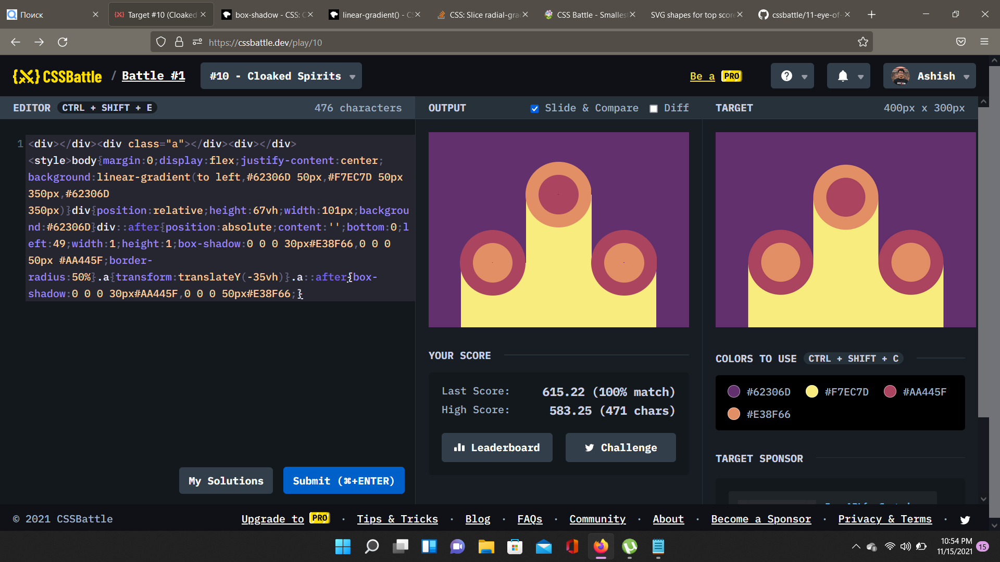

# Battle #1 - Pilot Battle

## #10 - Cloaked Spirits

[Link to the problem](https://cssbattle.dev/play/10)


- So in love with gradients now...
```html
<div></div>
<div class="a"></div>
<div></div>
<style>
    body {
        margin: 0;
        display: flex;
        justify-content: center;
        background: linear-gradient(to left, #62306D 50px, #F7EC7D 50px 350px, #62306D 350px)
    }

    div {
        position: relative;
        height: 67vh;
        width: 101px;
        background: #62306D
    }

    div::after {
        position: absolute;
        content: '';
        bottom: 0;
        left: 49;
        width: 1;
        height: 1;
        box-shadow: 0 0 0 30px#E38F66, 0 0 0 50px #AA445F;
        border-radius: 50%
    }

    .a {
        transform: translateY(-35vh)
    }

    .a::after {
        box-shadow: 0 0 0 30px#AA445F, 0 0 0 50px#E38F66;
    }
```
