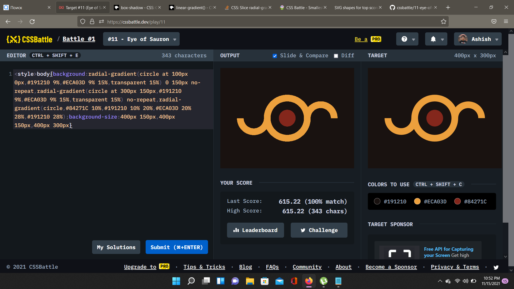

# Battle #1 - Pilot Battle

## #11 - Eye of Sauron

[Link to the problem](https://cssbattle.dev/play/11)



- Master the concepts of gradients first you fool!!
```html
<style>
body {
    background: 
        radial-gradient(circle at 100px 0px, #191210 9%, #ECA03D 9% 15%, transparent 15%) 0 150px no-repeat,
        radial-gradient(circle at 300px 150px, #191210 9%, #ECA03D 9% 15%, transparent 15%) no-repeat,
        radial-gradient(circle, #84271C 10%, #191210 10% 20%, #ECA03D 20% 28%, #191210 28%);
    background-size: 400px 150px, 400px 150px, 400px 300px
}
```
