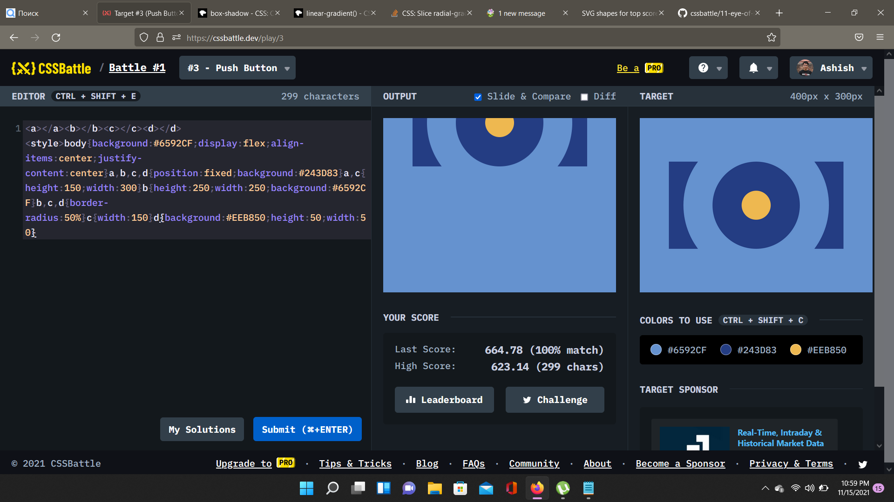

# Battle #1 - Pilot Battle

## #3 - Push Button

[Link to the problem](https://cssbattle.dev/play/3)

- GLITCH in the image below .. i dont know why 


```html
<a></a><b></b><c></c><d></d>
<style>
    body {
        background: #6592CF;
        display: flex;
        align-items: center;
        justify-content: center
    }

    a,
    b,
    c,
    d {
        position: fixed;
        background: #243D83
    }

    a,
    c {
        height: 150;
        width: 300
    }

    b {
        height: 250;
        width: 250;
        background: #6592CF
    }

    b,
    c,
    d {
        border-radius: 50%
    }

    c {
        width: 150
    }

    d {
        background: #EEB850;
        height: 50;
        width: 50
    }
```
