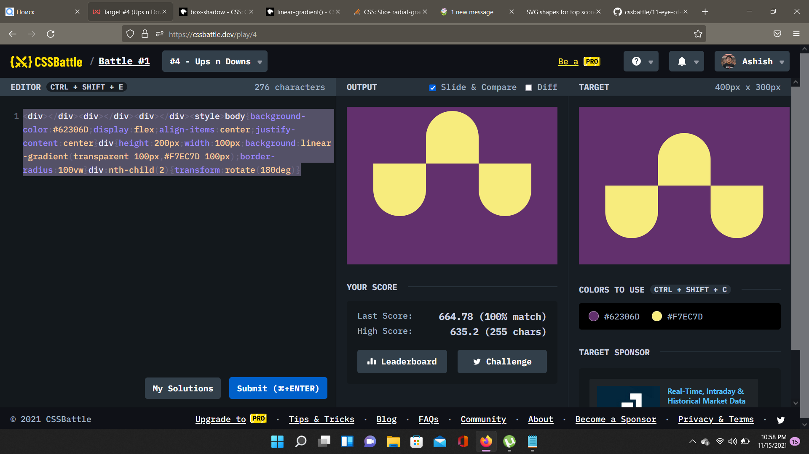

# Battle #1 - Pilot Battle

## #4 - Ups n Downs

[Link to the problem](https://cssbattle.dev/play/4)

- Maybe the problem is firefox ?? Submitting still shows 100%.


```html
<div></div>
<div></div>
<div></div>
<style>
    body {
        background-color: #62306D;
        display: flex;
        align-items: center;
        justify-content: center
    }

    div {
        height: 200px;
        width: 100px;
        background: linear-gradient(transparent 100px, #F7EC7D 100px);
        border-radius: 100vw
    }

    div:nth-child(2) {
        transform: rotate(180deg)
    }

```
