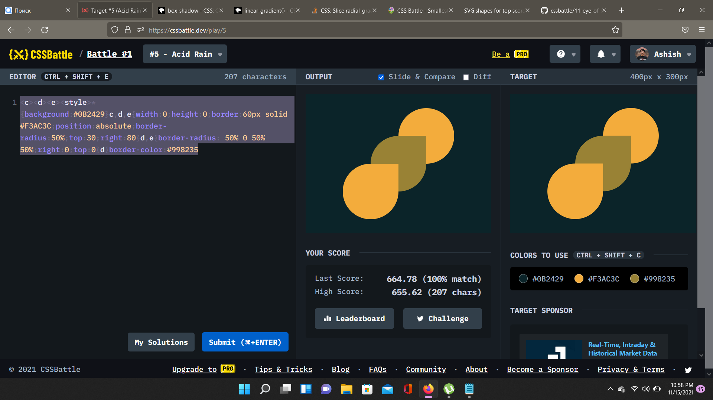

# Battle #1 - Pilot Battle

## #5 Acin Rain

[Link to the problem](https://cssbattle.dev/play/5)



- Well, this again is quite safe from GLITCHES.. it seems..
```html
<c><d><e>
<style>
    * {
        background: #0B2429
    }

    c,d,e {
        width: 0;
        height: 0;
        border: 60px solid #F3AC3C;
        position: absolute;
        border-radius: 50%;
        top: 30;
        right: 80
    }

    d,e {
        border-radius: 50% 0 50% 50%;
        right: 0;
        top: 0
    }

    d {
        border-color: #998235
    }
```
