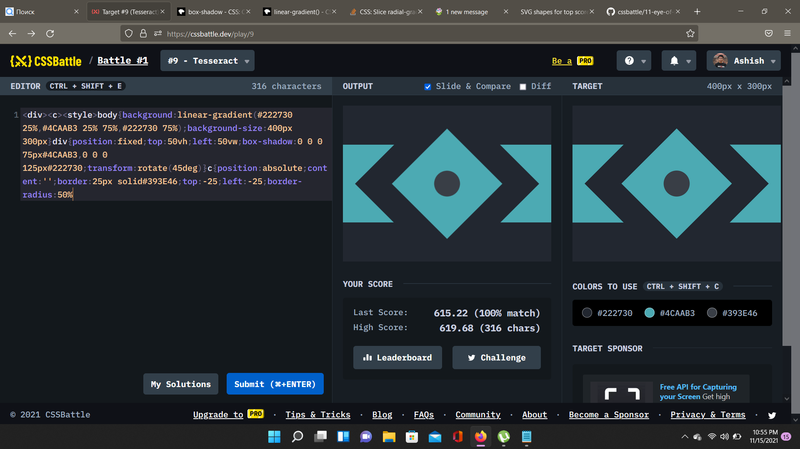

# Battle #1 - Pilot Battle

## #9 - Tesseract

[Link to the problem](https://cssbattle.dev/play/9)



- Gradients can do so much!! I didn't know until yesterday :p 
```html
<div>
<c>
<style>
    body {
        background: linear-gradient(#222730 25%, #4CAAB3 25% 75%, #222730 75%);
        background-size: 400px 300px
    }

    div {
        position: fixed;
        top: 50vh;
        left: 50vw;
        box-shadow: 0 0 0 75px#4CAAB3, 0 0 0 125px#222730;
        transform: rotate(45deg)
    }

    c {
        position: absolute;
        content: '';
        border: 25px solid#393E46;
        top: -25;
        left: -25;
        border-radius: 50%
    }
</style>
```
